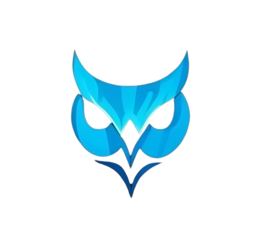

<!-- PROJECT LOGO -->
 

  

  <h3 align="center">ScriptOwl</h3>

  

    A video streaming platform built for learning using latest AI technology.
      
     
    <a href="https://scriptowl.vercel.app/"><strong>Visit ScriptOwl »</strong></a>
     
     
  

<!-- TABLE OF CONTENTS -->

  
Table of Contents

  <ol>
    <li>
      <a href="#about-the-project">About The Project</a>
      <ul>
        <li><a href="#built-with">Built With</a></li>
      </ul>
    </li>
    <li>
      <a href="#getting-started">Getting Started</a>
      <ul>
        <li><a href="#prerequisites">Prerequisites</a></li>
      </ul>
    </li>
    <li><a href="#license">License</a></li>
    <li><a href="#contact">Contact</a></li>
  </ol>

<!-- ABOUT THE PROJECT -->
## About The Project

ScriptOwl is a video streaming website platform that leverages the power of ChatGPT 3.5 Turbo, an advanced language model developed by OpenAI, to provide various features for enhancing user experience. The integration with ChatGPT 3.5 Turbo allows for the generation of video summaries, quizzes, and translations based on the video transcripts.

Features:
* Video Streaming: Users can stream videos directly on the platform, providing an intuitive and user-friendly video playback experience.
* Transcript Processing: The platform processes the video transcripts to extract valuable information that can be used for various purposes.
* Summary Generation: Using ChatGPT 3.5 Turbo, the platform generates concise summaries of the video content, enabling users to quickly grasp the key points.
* Quiz Generation: ChatGPT 3.5 Turbo generates interactive quizzes based on the video transcripts, allowing users to test their understanding and knowledge.
* Translation Support: The language model's translation capabilities enable users to translate video transcripts into different languages, expanding accessibility and reach.

(<a href="#readme-top">back to top</a>)

### Built With

The video streaming website platform with ChatGPT 3.5 Turbo integration is built using a combination of modern technologies and frameworks. The following is a summary of the key technologies used:

* 
* 
* 
* 
* 
* 
* 
* 

(<a href="#readme-top">back to top</a>)

<!-- GETTING STARTED -->
## Getting Started

Follow these steps to set up the project locally:

1. Clone the repository: git clone https://github.com/jchen396/ScriptOwl.git
2. Navigate to the client and/or directory: cd client
3. Install the required dependencies: npm install
4. Start the development server: npm start
5. Open your web browser and visit http://localhost:3000 to access the video streaming website.

(<a href="#readme-top">back to top</a>)

### Prerequisites

Before setting up and running this video streaming website platform, ensure that you have the following dependencies installed:

* Node.js (version 16 or above)
* npm (usually comes bundled with Node.js)
* Python (version 3.7.3)
* FFmpeg (for video processing)

Please make sure you have installed these prerequisites on your system before proceeding with the setup.

(<a href="#readme-top">back to top</a>)

<!-- LICENSE -->
## License

Distributed under the MIT License.

(<a href="#readme-top">back to top</a>)

<!-- CONTACT -->
## Contact

support@jackiedev.com

Project Link: [https://github.com/jchen396/ScriptOwl](https://github.com/jchen396/ScriptOwl)

(<a href="#readme-top">back to top</a>)

